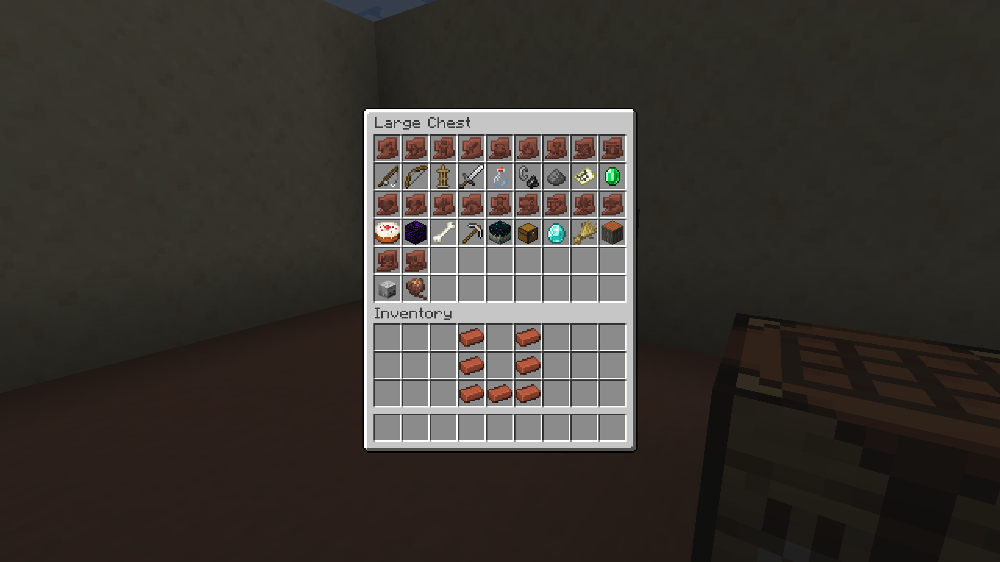

# Sherd_Duplicating
A small Datapack that allows Pottery Sherd Duplication (1.20+)

As of 1.21, This pack hasn't really been playtested to see if it's balanced in terms of how me and my friends want to use it, so it's Liable to undergo major changes in the future. I know some of the items used to duplicate are a bit odd (Armour Stands, Crying Obsidian, Cakes) or hard to obtain (Breeze Rods, Wind Charges, Skeleton Skull), and the cost of 7 bricks (nearly enough for 2 full pots) is steep. I may make huge changes to the items used to duplicate, or to the way you duplicate in general.

## Recipes & Format
Each Sherd can be duplicated, in a similar fashion to Armour Trim Duplication, with Bricks, a donor sherd, and a duplicating Item.

Below you can find a table explaining the items used to duplicate each Pottery Sherd.

|Sherd Name|Duplicating Item|
| --- | --- |
|`Angler`|Fishing Rod|
|`Archer`|Bow|
|`Arms Up`|Armour Stand|
|`Blade`|Iron Sword|
|`Brewer`|Glass Bottle|
|`Burn`|Flint & Steel|
|`Danger`|Gunpowder|
|`Explorer`|Map (NOT EMPTY MAP)|
|`Flow` (1.21+)|Wind Charge|
|`Friend`|Emerald|
|`Guster` (1.21+)|Breeze Rod|
|`Heart`|Cake|
|`Heartbreak`|Crying Obsidian|
|`Howl`|Bone|
|`Miner`|Iron Pickaxe|
|`Mourner`|Skulk Catalyst|
|`Plenty`|Chest|
|`Prize`|Diamond|
|`Scrape` (1.21+)|Iron Axe|
|`Sheaf`|Wheat|
|`Shelter`|Acacia Log|
|`Skull`|Skeleton Skull|
|`Snort`|Pitcher Pod|

This Image shows each sherd above their respective crafting Item:

